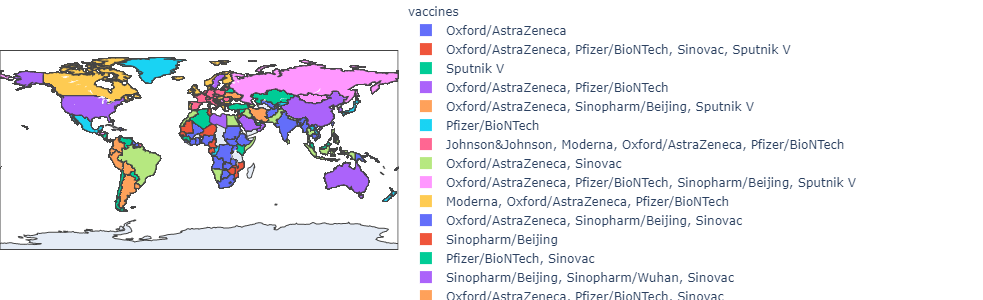

# Covid19-Vaccine-Analysis

Analyzing the covid vaccination data found on Kaggle to see which countries have used which vaccine, and has vaccinated how many people using python.

- Pre-requisites
  - numpy
  - pandas
  - matplotlib.pyplot
  - seaborn
  - plotly.express
  - plotly.offline
 

The data can be found on Kaggle:   
https://www.kaggle.com/gpreda/covid-world-vaccination-progress?select=country_vaccinations.csv

Reference:  
https://thecleverprogrammer.com/2021/04/13/covid-19-vaccines-analysis-with-python/

